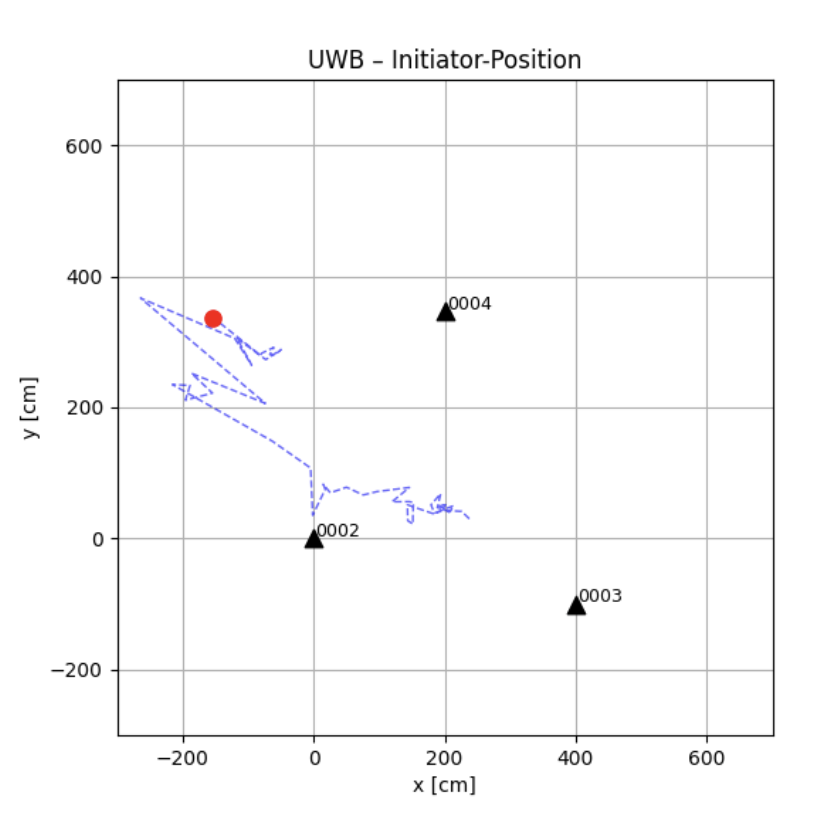
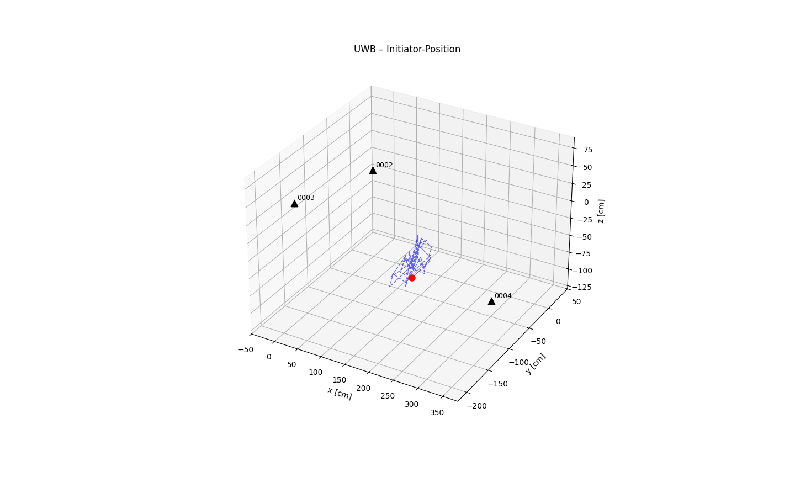
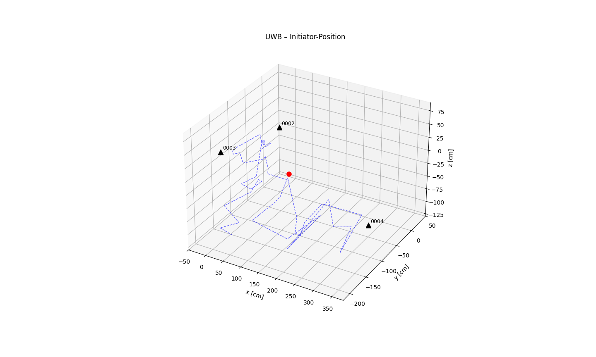

## Project Overview
This repository focuses on Ultra-Wideband (UWB) for indoor localization. A remote-controlled car with Raspberry Pi travels in a lab equipped with UWB anchors. The goal is to measure and analyze the positioning accuracy of UWB modules.

## Hardware

- **DWM3001C Modules**: Used as both UWB anchors (beacons) and tag (client)

## Software Structure

- **Scripts**: Python scripts for data processing, trilateration, and visualization.
  - `triang.py`: Main script for trilateration and live plotting.
  - `serial_data/`: Contains scripts for serial communication and calibration.
  - `processing/`: Includes modules for data processing and plotting.

## Media

Below are examples of the visualizations generated by the scripts:





## Usage

1. Clone the repository:
   ```bash
   git clone https://github.com/Indoor-Localization-HTWG/UWB.git
   ```

2. Install dependencies:
   ```bash
   pip install -r serial_data/requirements.txt
   ```

3. Run the main script:
   ```bash
   python triang.py
   ```

## Documentation

Refer to the following documents for detailed information:

- [DWM3001C Data Sheet](media/DWM3001C%20Data%20Sheet.pdf)
- [Developer Manual](media/DWM3001CDK_Developer_Manual_QM33SDK-1.0.2.pdf)
- [Quick Start Guide](media/DWM3001CDK_Quick_Start_Guide_QM33SDK-1.0.0.pdf)

